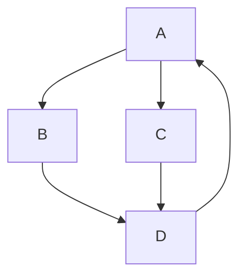
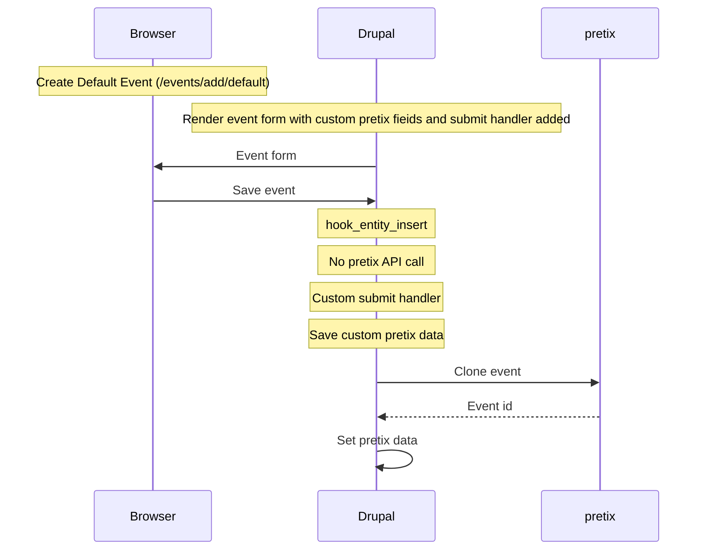

# DPL pretix

[DPL CMS] module for integration with the [pretix] ticketing platform.

Builds on ideas and experiences from <https://github.com/itk-dev/itk_pretix>.

## Installation

Enable the module and go to `/admin/config/dpl_pretix` to configure the module.

## Usage

The module will add a "pretix" section on all events.

Log messages: `/admin/reports/dblog?type[]=dpl_pretix`

## pretix

We need a _template event_ in pretix, and this template event [will be
cloned](https://docs.pretix.eu/en/latest/api/resources/events.html#post--api-v1-organizers-(organizer)-events-(event)-clone-)
to create new events in pretix.

The template event must

1. be a multiple dates event
2. have single subevent (date)

## Event flow



### Create event



### Edit event

### Delete event

## pretix API client

As of now, we cannot `composer require` dependencies when building custom modules for [DPL CMS], and therefore we use a
slightly customized version of [`itk-dev/pretix-api-client-php`] to talk to [pretix].

Two of [the dependencies of
`itk-dev/pretix-api-client-php`](https://github.com/itk-dev/pretix-api-client-php/blob/develop/composer.json)
(`doctrine/collections` and `guzzlehttp/guzzle`) are (indirectly) [required by DPL
CMS](https://github.com/danskernesdigitalebibliotek/dpl-cms/blob/develop/composer.json).

The dependency on [`symfony/options-resolver`](https://symfony.com/doc/current/components/options_resolver.html) can we,
under duress, choose to live without, and [a small patch](src/Pretix/ApiClient/patches/pretix-api-client.patch) removes
use of the OptionsResolver component.

See the `build:pretix-api-client` task in `Taskfile.yml` for details on how the modified version of
`itk-dev/pretix-api-client-php` is actually built.

## Coding standards

``` shell
task dev:coding-standards:check
```

``` shell
docker run --rm --volume "$PWD:/mnt" koalaman/shellcheck:stable scripts/create-release scripts/code-analysis
```

## Code analysis

``` shell
task dev:code-analysis
```

[`itk-dev/pretix-api-client-php`]: https://github.com/itk-dev/pretix-api-client-php
[itk-dev/pretix-api-client-php[DPL CMS]: https://github.com/danskernesdigitalebibliotek/dpl-cms/
[pretix]: https://pretix.eu/about/en/ "Ticketing software that cares about your event—all the way."

``` shell
docker compose build && docker compose run --rm php scripts/create-release dev-test
```

## Bugs and caveats

* It seems that updating an event instance uses old data for the update.
